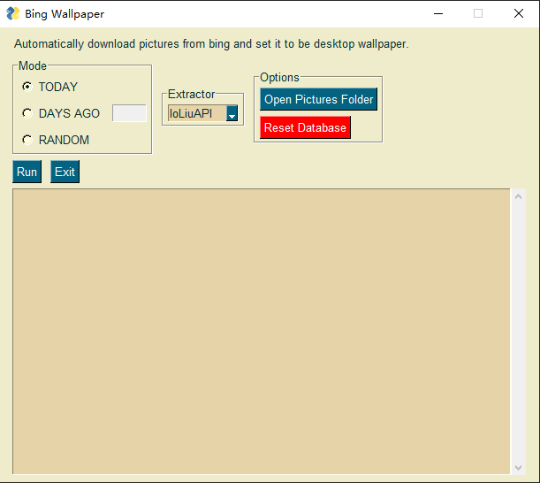

# wallpaper

A GUI for setting pictures from bing to be your desktop wallpaper.

[This](https://github.com/Blanket58/bing_wallpaper) is the orginal version of this project, it is mostly written in R. One day a thought strike me, why wouldn’t me write a pure python version of it and give it a gui? And that’s it. :point_down:

